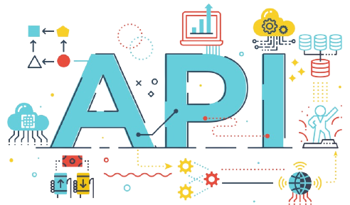
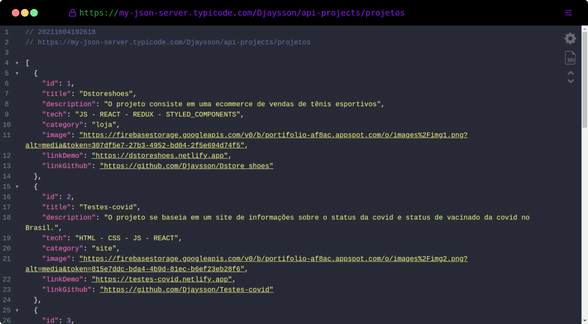

<h1 align="center">
    
   
</h1>

O repositório **Api-projects** é Uma demonstração do My JSON Server com dados dos meus projetos.

<ul>
  <li><a href="https://my-json-server.typicode.com/Djaysson/api-projects/projetos">Api-projects</a>
</li> 
</ul>

<h1 align="center">
    
</h1>

## 🚀 Métodos de requisição

- GET
- POST
- PUT
- DELETE

```sh
  As alterações não são persistentes entre as chamadas.
```

Feito com ❤️ por Djayson Rodrigues 👋 [Entrar em contato!](https://www.linkedin.com/in/djaysonrodrigues/)
